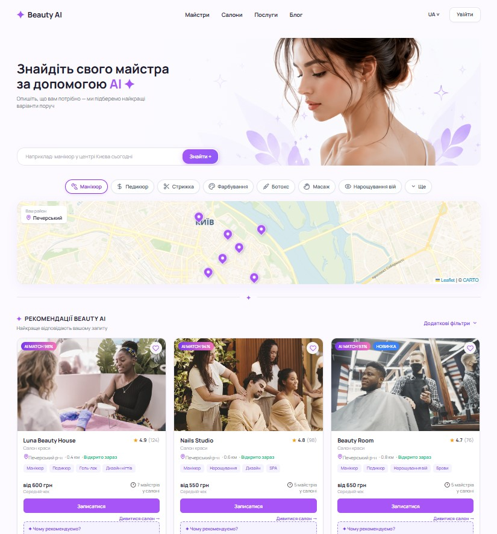

# Beauty AI Frontend

Frontend application for **Beauty AI** — a beauty services booking platform with personalized recommendations and salon discovery.

## Overview

Beauty AI is a team project focused on simplifying the process of finding and booking beauty services.

The frontend provides a modern responsive interface where users can:

* search for beauty services and salons;
* browse service categories;
* view personalized recommendation sections;
* explore nearby beauty locations on an interactive map;
* discover partner offers and top-rated services;
* use a responsive interface across desktop and mobile devices.
  
## Preview

### Desktop



### Mobile

<p align="center">
  
</p>

## My Contribution

As part of the project, I worked on the frontend implementation and UI development.

My contribution includes:

* implementing the main frontend interface;
* building reusable React components;
* implementing responsive layouts;
* developing search and category filtering UI;
* integrating the salon map section;
* adapting the interface to the product and UX requirements;
* organizing the frontend project structure.

## Tech Stack

* **React**
* **TypeScript**
* **Vite**
* **CSS**
* **OpenStreetMap**

## Main Features

### Search & Navigation

Users can search for beauty services and navigate through the main sections of the platform.

### Category Filters

The interface includes category-based filtering to help users quickly find relevant beauty services.

### Beauty AI Recommendations

The product concept is based on AI-powered, personalized recommendations that prioritize the most relevant beauty services for each user.

### Salon Map

The frontend includes an interactive map section for discovering beauty locations.

### Responsive Design

The interface is designed to work across desktop and mobile screen sizes.

## Project Structure

```text
beauty-ai-frontend/
├── public/
├── src/
│   ├── assets/
│   ├── App.tsx
│   ├── CategoryFilters.tsx
│   ├── FilterBar.tsx
│   ├── MapSection.tsx
│   ├── App.css
│   ├── index.css
│   ├── styles.css
│   └── main.tsx
├── package.json
├── vite.config.ts
├── tsconfig.json
└── README.md
```

## Getting Started

### 1. Clone the repository

```bash
git clone https://github.com/prutkih86-oss/beauty-ai-frontend.git
```

### 2. Navigate to the project

```bash
cd beauty-ai-frontend
```

### 3. Install dependencies

```bash
npm install
```

### 4. Start the development server

```bash
npm run dev
```

The application will be available at the local Vite development URL shown in the terminal.

## Project Type

**Team Project — Beauty AI Platform**

The project is being developed as a cross-functional product involving product management, backend, frontend, Python development, UI/UX and data analytics.

## Repository

[GitHub Repository](https://github.com/prutkih86-oss/beauty-ai-frontend)
