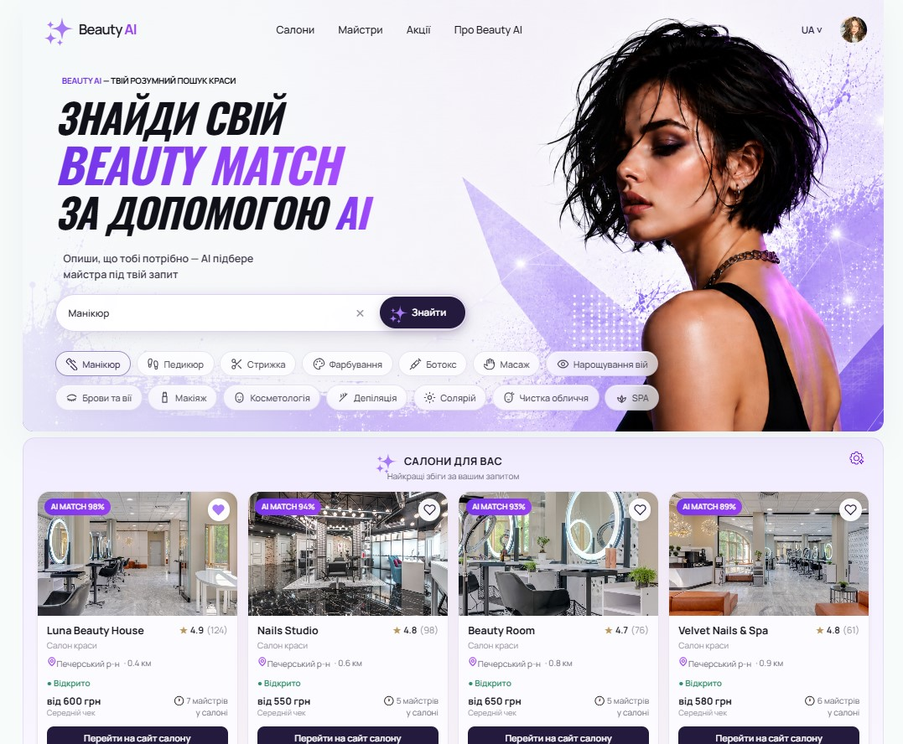
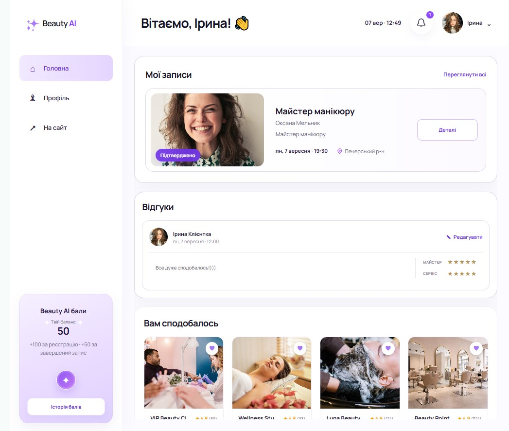
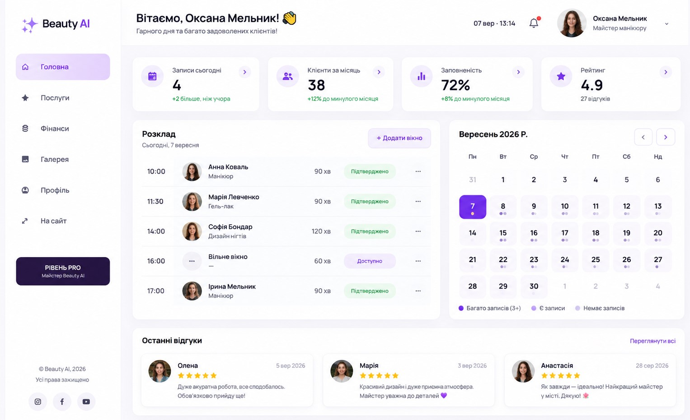
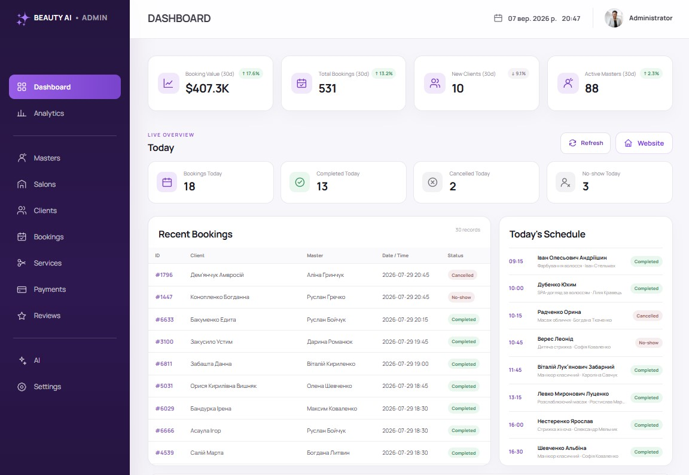
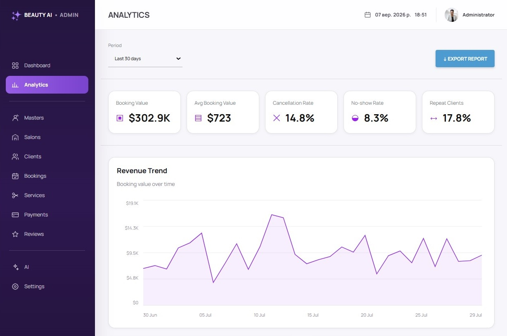
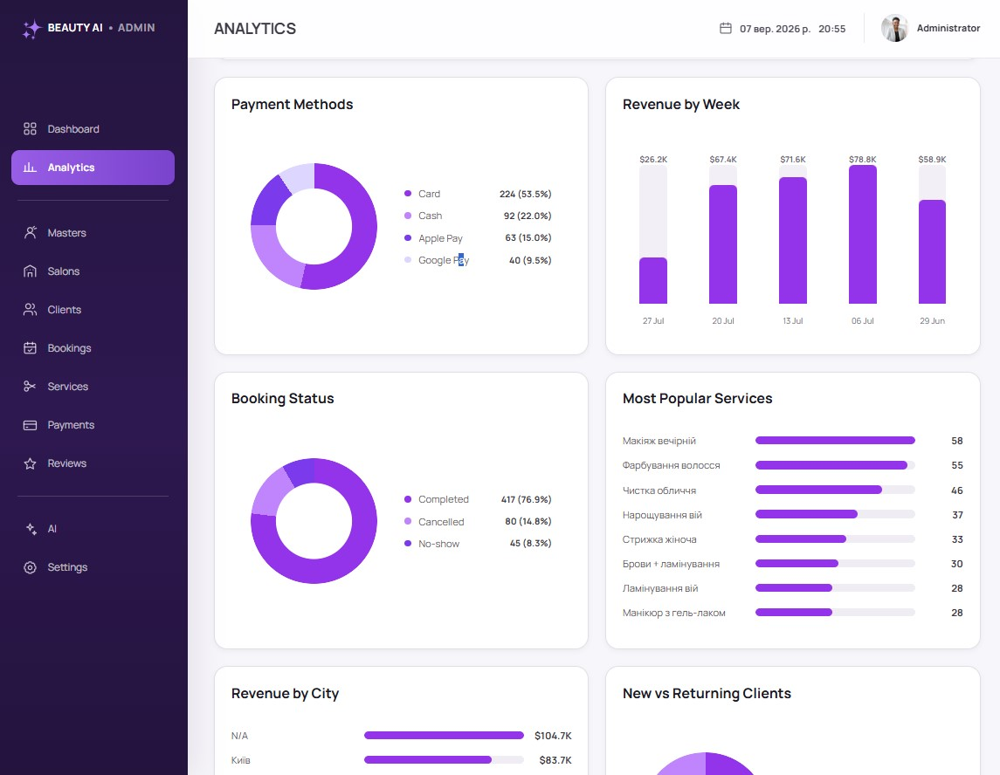

# Beauty AI Frontend

Frontend application for **Beauty AI** — a beauty services booking platform with personalized recommendations, salon discovery, booking workflows, role-based dashboards, and analytics.

## Overview

Beauty AI is a team project focused on simplifying the process of finding, booking, and managing beauty services.

The frontend includes interfaces for:

- customers;
- beauty masters;
- administrators.

The platform combines service discovery, booking functionality, personalized recommendations, dashboards, analytics, and administrative tools in one web application.

## Preview

### Home Page



### User Dashboard



### Master Dashboard



### Admin Dashboard



### Admin Analytics





## My Contribution

As part of the project, I worked on frontend implementation, interface development, dashboards, analytics modules, and platform integration.

My contribution includes:

- implementing and updating the main frontend interface;
- building reusable React components;
- developing search and category filtering;
- integrating the salon map;
- developing role-based dashboards for customers, masters, and administrators;
- implementing dashboard and analytics interfaces;
- working with platform data and API integration;
- adapting the UI to product and UX requirements;
- organizing and maintaining the frontend project structure.

## Tech Stack

- **React**
- **TypeScript**
- **Vite**
- **CSS**
- **REST API**
- **JWT Authentication**
- **OpenStreetMap**

## Main Features

### Search & Navigation

Users can search for beauty services, salons, and navigate through the main sections of the platform.

### Category Filters

The interface includes category-based filtering to help users find relevant beauty services.

### Personalized Recommendations

The platform includes personalized recommendation sections based on the Beauty AI product concept.

### Salon Map

The frontend includes an interactive map for discovering beauty locations.

### User Dashboard

Customers can view and manage appointments, reviews, recommendations, and loyalty information.

### Master Dashboard

Masters can manage appointments, availability, schedules, client activity, reviews, and service-related information.

### Admin Dashboard

Administrators have access to platform-level information including bookings, clients, masters, salons, services, payments, and reviews.

### Analytics

The admin interface includes analytics modules for:

- booking value;
- booking volume;
- average booking value;
- cancellation rate;
- no-show rate;
- repeat clients;
- revenue trends;
- payment methods;
- revenue by period.

### Authentication & Roles

The frontend uses JWT-based authentication and supports role-based access for:

- customer;
- master;
- admin.

## Project Structure

```text
beauty-ai-frontend/
├── public/
├── src/
│   ├── assets/
│   ├── components/
│   ├── admin/
│   ├── dashboards/
│   ├── App.tsx
│   ├── App.css
│   ├── index.css
│   └── main.tsx
├── package.json
├── vite.config.ts
├── tsconfig.json
└── README.md
