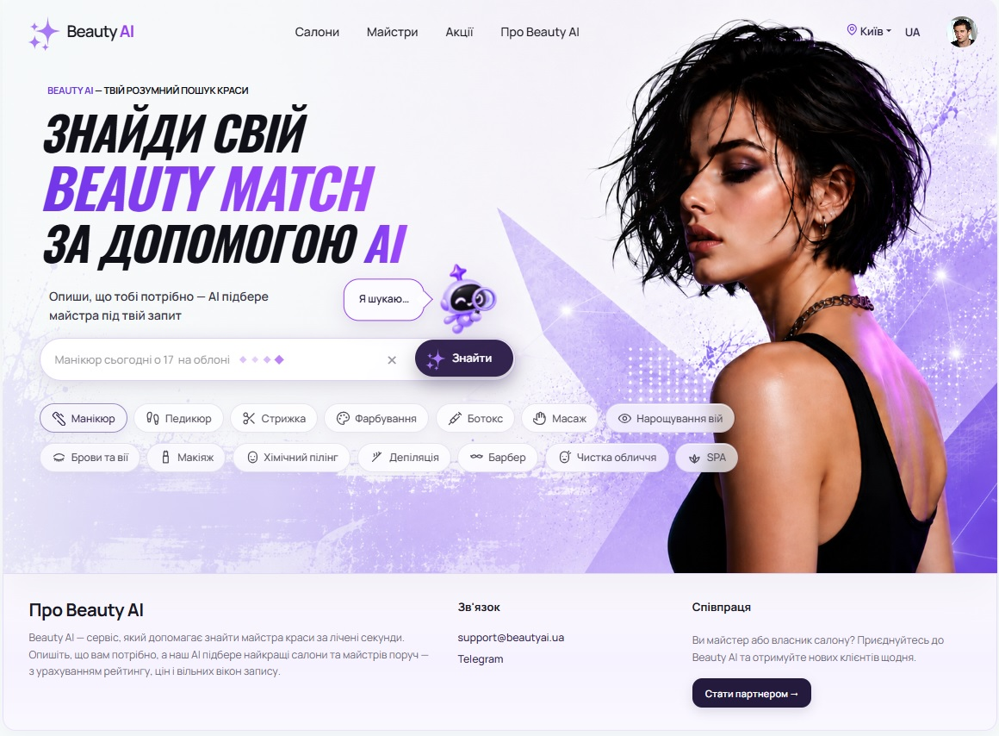
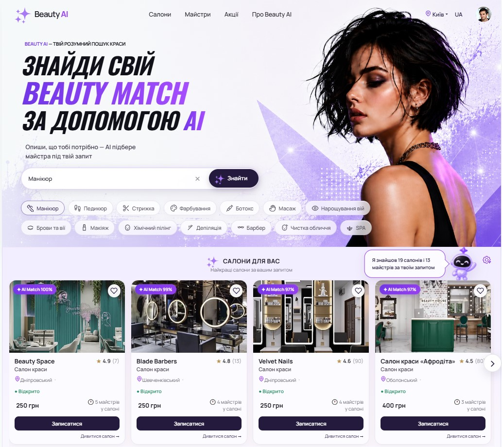
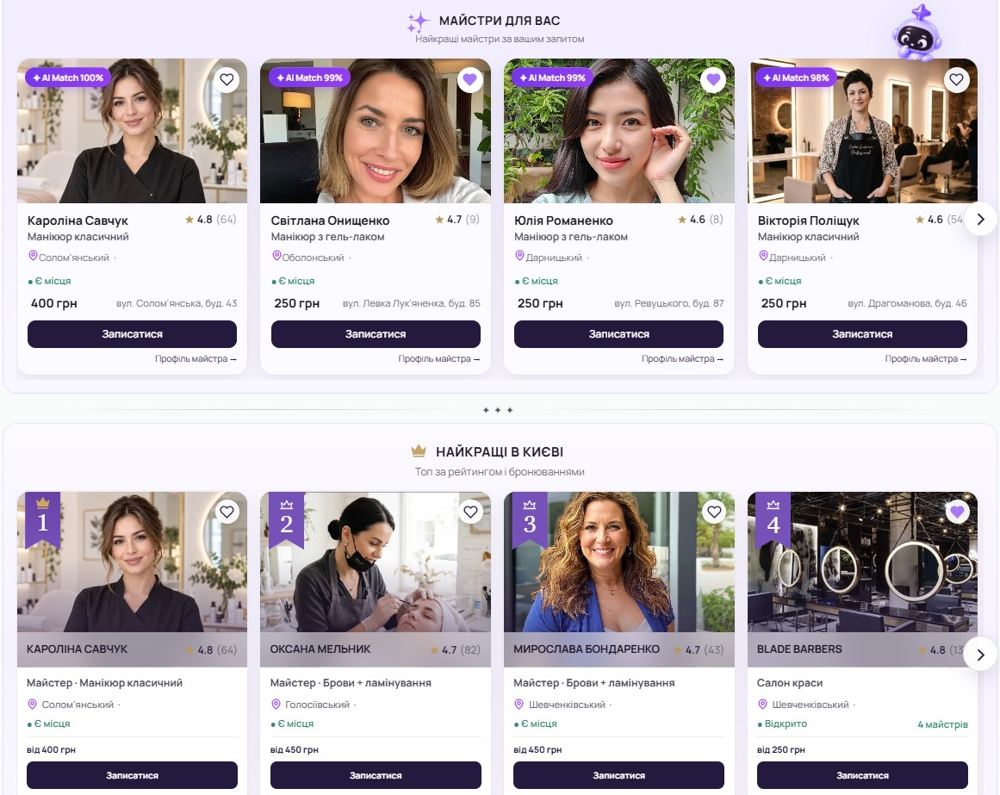
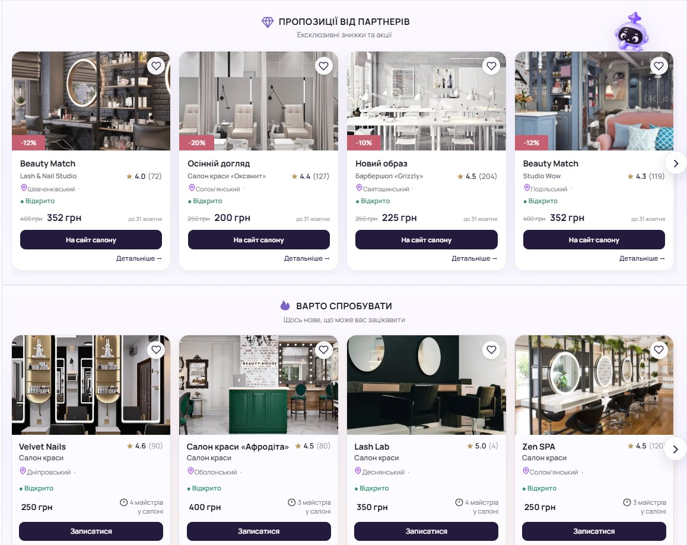
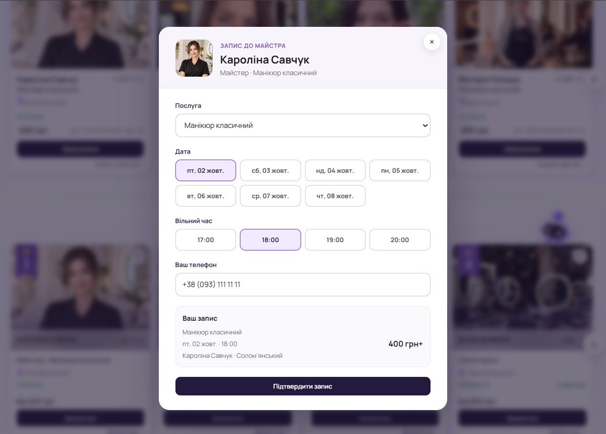
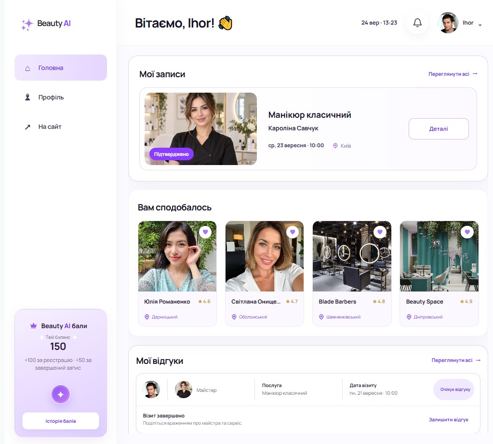
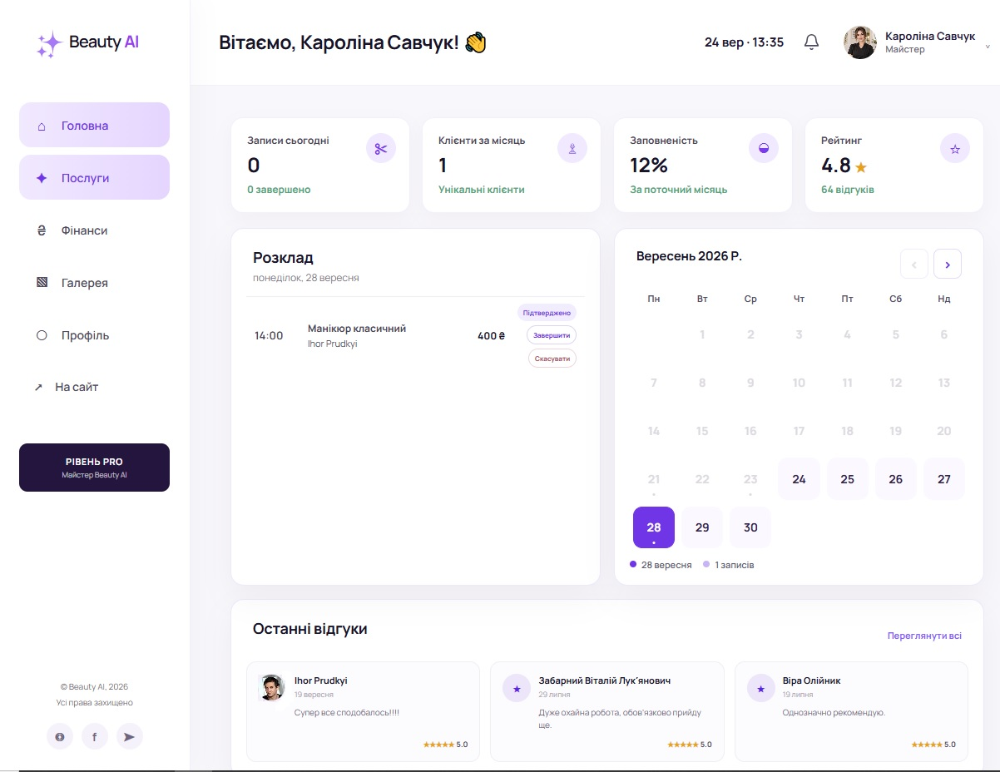
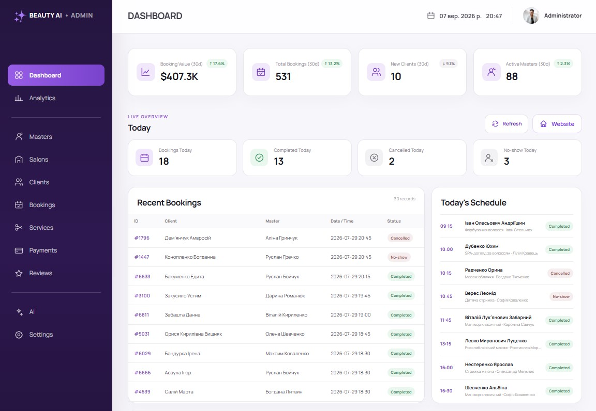

# Beauty AI Platform

**Beauty AI** is a team project for beauty service discovery and booking, combining personalized recommendations, salon discovery, booking workflows, role-based dashboards, interactive maps, and AI-assisted search.

## Overview

Beauty AI is a platform designed to simplify the process of finding, booking, and managing beauty services.

The platform includes interfaces for:

- customers;
- beauty masters;
- administrators.

It combines service discovery, booking functionality, personalized recommendations, role-based dashboards, interactive maps, AI-assisted search, and platform integration in one web application.

## Preview

### Home Page



### Personalized Recommendations & Discovery





### Booking Flow



### User Dashboard



### Master Dashboard



### Admin Dashboard



## My Contribution

My role in the project covered frontend development, UI/UX implementation, database work, platform integration, search functionality, dashboards, and AI-assisted features.

My contribution includes:

- designing and implementing the main user interfaces;
- developing and maintaining the frontend using React and TypeScript;
- building reusable React components;
- designing and populating the project database;
- developing search logic and category filtering;
- implementing AI-assisted search functionality;
- integrating the salon map using OpenStreetMap;
- implementing personalized recommendation sections;
- developing the booking flow;
- developing role-based dashboards for customers, masters, and administrators;
- integrating the frontend with the backend through REST API;
- adjusting backend endpoints and data structures when required during integration;
- implementing JWT-based authentication flows;
- adapting the UI and application logic to product and UX requirements;
- organizing and maintaining the frontend project structure.

## Tech Stack

- **React**
- **TypeScript**
- **Vite**
- **CSS**
- **REST API**
- **JWT Authentication**
- **OpenStreetMap**
- **Database Design**
- **Data Management**

## Main Features

### AI-Assisted Search

Users can describe the beauty service they are looking for and interact with the platform through the Beauty AI search interface.

The search functionality is designed to help users find relevant services, salons, and specialists based on their request.

### Search & Navigation

Users can search for beauty services, salons, and masters and navigate through the main sections of the platform.

### Category Filters

The interface includes category-based filtering to help users quickly find relevant beauty services.

### Personalized Recommendations

The platform includes recommendation sections for salons, masters, partner offers, and other relevant beauty services.

### Salon Map

The platform includes an interactive map for discovering beauty locations.

### Booking Flow

Users can select a service, available date and time, enter contact information, and confirm an appointment.

### User Dashboard

Customers can view and manage appointments, favourites, reviews, and loyalty information.

### Master Dashboard

Masters can manage appointments, availability, schedules, client activity, reviews, services, and profile information.

### Admin Dashboard

Administrators have access to platform-level information including:

- bookings;
- clients;
- masters;
- salons;
- services;
- payments;
- reviews;
- analytics;
- system settings.

Detailed analytics are implemented in the separate **Beauty AI Admin Panel** project.

### Authentication & Roles

The platform uses JWT-based authentication and supports role-based access for:

- customer;
- master;
- admin.

## Database & Platform Integration

As part of the project, I worked with the platform database and data structures used by the frontend and backend.

This included:

- designing and populating the project database;
- working with platform entities and relationships;
- integrating frontend data with REST API endpoints;
- adapting data structures during integration;
- adjusting backend endpoints when necessary to support frontend functionality.

## Project Structure

```text
beauty-ai-frontend/
├── public/
├── docs/
├── src/
│   ├── assets/
│   ├── api/
│   ├── dashboard/
│   ├── App.tsx
│   ├── App.css
│   ├── BeautyAssistant.tsx
│   ├── CategoryFilters.tsx
│   ├── FilterBar.tsx
│   ├── MapSection.tsx
│   ├── index.css
│   └── main.tsx
├── package.json
├── vite.config.ts
├── tsconfig.json
└── README.md
